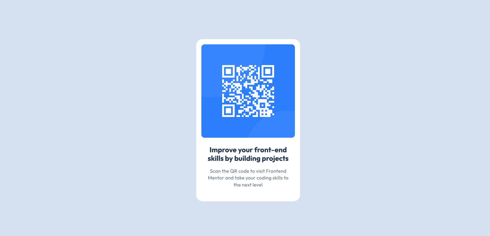

# Frontend Mentor - QR code component solution

This is a solution to the [QR code component challenge on Frontend Mentor](https://www.frontendmentor.io/challenges/qr-code-component-iux_sIO_H)

### Screenshot

- Solution URL: [GitHub repo](https://github.com/VasylRosokha/qr-code-component)
- Live Site URL: [GitHub pages](https://your-live-site-url.com)

### Built with

- Semantic HTML5 markup
- CSS custom properties
- Flexbox
